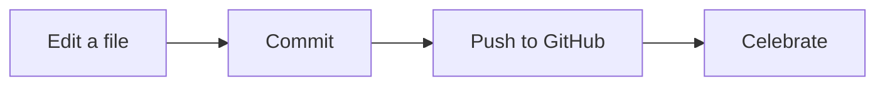

# Chapter 4: Markdown: Write Like a Pro ✍️

🎯 **Goals:** Learn Markdown properly, the tiny formatting language that makes every README, issue, and pull request on GitHub look good. By the end you'll be able to write a polished project page with headings, lists, links, images, tables, callouts, and even diagrams.

Everything in this chapter happens in your web browser. Make a throwaway repository called `markdown-playground` (Chapter 3 shows how) and try each example as you read.

---

## 🧠 What is Markdown?

**Markdown** is a way of writing formatted text using ordinary keyboard symbols. You type `**bold**`, and GitHub shows **bold**. You type `# Title`, and GitHub shows a big heading.

Why does it exist? Because plain text is the one format that works everywhere and that Git can compare line by line. Markdown gives plain text a little style without hidden formatting, so when you look at your history (Chapter 5), you can see exactly what changed.

Any file whose name ends in **`.md`** is a Markdown file. GitHub shows it nicely formatted. You also use Markdown when you write:

- a project's front page (`README.md`)
- pull requests and issues (Chapters 8 and 9)
- comments and reviews
- the description of a release, and much more

> 💡 **You'll never need to memorize this.** Skim the whole chapter once, then come back whenever you need a trick. The cheat table at the end collects everything.

## 👀 The best habit: the Preview tab

Whenever you edit on GitHub, the editor has two tabs: **Edit** and **Preview**. Click **Preview** to see how your Markdown will look before you save it. If something looks wrong, switch back, fix it, and preview again. No harm done.

**Screenshot:** The GitHub file editor with the **Edit** and **Preview** tabs labeled.
{ .shot }

## 🔠 Headings

Start a line with one or more `#` symbols, then a space:

```markdown
# Heading level 1 (the page title)
## Heading level 2 (a section)
### Heading level 3 (a subsection)
#### Heading level 4
```

- Use **one** `#` heading per file, for the title.
- Use `##` for sections and `###` inside those.
- Always put a **space** after the `#` symbols. `#Title` won't work.

GitHub also builds a clickable **table of contents** for you. On a rendered Markdown file, click the small list icon at the top right to see every heading.

## 📝 Paragraphs and line breaks

A **blank line** starts a new paragraph. This is the rule that trips up most beginners:

```markdown
This is the first line.
This is still the same paragraph.

This is a new paragraph.
```

To force a line break *inside* a paragraph, end the line with **two spaces**, or put a backslash `\` at the end:

```markdown
Roses are red,\
Violets are blue.
```

## 💪 Bold, italic, and friends

| You type | You get |
|----------|---------|
| `**bold**` | **bold** |
| `*italic*` | *italic* |
| `***bold and italic***` | ***bold and italic*** |
| `~~crossed out~~` | ~~crossed out~~ |
| `` `code` `` | `code` |
| `<mark>highlight</mark>` | <mark>highlight</mark> |
| `H<sub>2</sub>O` | H<sub>2</sub>O |
| `x<sup>2</sup>` | x<sup>2</sup> |

A small trick: you can use `_underscores_` instead of asterisks for italics, and `__double underscores__` for bold.

## 📋 Lists

### Bullet lists

Use `-`, `*`, or `+` followed by a space:

```markdown
- Apples
- Bananas
- Cherries
```

### Numbered lists

```markdown
1. Preheat the oven
2. Mix the batter
3. Bake for 20 minutes
```

You can number every line `1.` and Markdown will count for you. That makes it easy to reorder steps later.

### Nested lists

**Indent with four spaces** to put a list inside another:

```markdown
1. Prepare the ingredients
    - Flour
    - Eggs
    - Milk
2. Cook
    - Medium heat
    - Flip once
```

### Task lists (checkboxes)

```markdown
- [x] Make an account
- [x] Create my first repository
- [ ] Learn branches
- [ ] Open a pull request
```

On GitHub, these become real checkboxes you can click in issues and pull requests. The page even shows progress like "2 of 4 tasks".

## 🔗 Links

### Link to a website

```markdown
[GitHub's home page](https://github.com)
```

The text in square brackets is what people see. The address goes in parentheses.

### Link to another file in your repository

Use the path from the current file:

```markdown
[Read the about page](about.md)
[Recipes](recipes/pancakes.md)
```

Relative links keep working even if you rename or move the whole repository, so prefer them over full web addresses for your own files.

### Link to a heading inside the same page

GitHub makes an address from each heading: lowercase, spaces become hyphens, and punctuation is dropped.

```markdown
[Jump to Lists](#lists)
```

### A bare web address

Just paste it. GitHub turns `https://github.com` into a link on its own.

## 🖼️ Images

Images use the same pattern as links, with a `!` at the front:

```markdown

```

- The text in the square brackets is the **alt text**. It's read aloud to people who use screen readers, and it shows if the image can't load. Always describe what the picture shows.
- The path points to the image file.

### The easy way to add an image

1. While editing a file on GitHub, **drag an image** from your computer into the editor.
2. GitHub uploads it and writes the Markdown for you.
3. Preview, then commit.

### Putting an image inside your repository

1. On your repo, click **Add file → Upload files** and drag the picture in.
2. Commit it. Keeping images in an `images` folder is tidy. (Type `images/` before the file name when you create it, as in Chapter 3.)
3. Link to it with ``.

### Resizing an image

Markdown has no size option, but you can mix in a little HTML:

```html

```

## 💻 Code

### Inline code

Wrap a word in single backticks (the key above Tab) to show it in a code font: `` `README.md` ``.

### Code blocks

Put three backticks on a line by themselves above and below your text. Add a language name after the first three for color:

````markdown
```python
print("Hello, GitHub!")
```
````

Even if you never write code, code blocks are perfect for anything that must be shown exactly as typed, like file names, menu paths, or a poem with careful spacing.

## 💬 Quotes

Start a line with `>`:

```markdown
> The best way to learn is to build something.
> – A wise person
```

## 📊 Tables

Separate columns with `|` and add a dashed line under the header:

```markdown
| Name | Role     | Favorite color |
|------|----------|----------------|
| Ana  | Designer | Purple         |
| Ben  | Writer   | Green          |
```

You don't need to line the columns up. It only matters that each row has the same number of `|` separators.

**Alignment:** use colons in the dashed line.

```markdown
| Left | Center | Right |
|:-----|:------:|------:|
| a    |   b    |     c |
```

## 🚨 Alerts: eye-catching callout boxes

GitHub supports special quote blocks that become colored callouts:

```markdown
> [!NOTE]
> Useful information that people should know.

> [!TIP]
> A helpful hint to make things easier.

> [!IMPORTANT]
> Something people really need to see.

> [!WARNING]
> Something that could cause trouble.

> [!CAUTION]
> Something with serious consequences.
```

Try these in a README to guide readers. Use them sparingly, so they stand out.

## 🙈 Hide long content: collapsible sections

Use a bit of HTML to tuck details away until someone clicks:

```html
<details>
<summary>Click to see the answer</summary>

The answer is 42.

</details>
```

Leave a **blank line** after `<summary>` and before `</details>`, or the Markdown inside may not format.

## ➖ Dividers, comments, and escaping

- Three dashes on their own line, `---`, draw a horizontal line.
- To leave a note that readers can't see, use a comment: `<!-- Remember to update this -->`.
- To show a symbol literally instead of letting Markdown use it, put a backslash first: `\*not italic\*` shows *not italic* with its stars.

## 🧷 Footnotes

```markdown
Markdown was invented in 2004.[^1]

[^1]: By John Gruber, with help from Aaron Swartz.
```

GitHub puts the footnote text at the bottom of the page with a link back.

## 🗺️ Diagrams with Mermaid

GitHub can draw diagrams from plain text. Put the word `mermaid` after the three backticks:

````markdown

````

Preview it and you'll see a flowchart with boxes and arrows. Mermaid can also draw timelines, org charts, and more. Search "Mermaid diagram syntax" when you're ready to explore.

## ✨ GitHub extras that work in comments, issues, and pull requests

| Type | What happens |
|------|--------------|
| `@username` | Mentions a person, who gets a notification |
| `#12` | Links to issue or pull request number 12 |
| `:tada:` | Shows a party popper emoji. Browse the names at <https://github.com/ikatyang/emoji-cheat-sheet> |
| `Closes #12` | In a pull request, closes issue 12 when merged |
| A pasted image | Uploads it and embeds it |
| A pasted web address | Becomes a link |

## 🏆 Anatomy of a great README

Your README is the front door of your project. A friendly structure that works for almost anything:

````markdown
# Project Name

One sentence that says what this is and who it's for.


## ✨ What's inside
- The first thing
- The second thing

## 🚀 How to use it
1. Step one
2. Step two

## 🤝 How to help
Ideas and corrections are welcome! Open an issue to say hello.

## 📄 License
Made available under the MIT license.
````

Chapter 27 (Templates & Snippets) has complete README templates you can copy.

## 🧪 Cheat table

| I want to... | Type |
|--------------|------|
| A title | `# Title` |
| A section | `## Section` |
| Bold / italic | `**bold**` / `*italic*` |
| A bullet / number | `- item` / `1. item` |
| A checkbox | `- [ ] task` |
| A link | `[text](https://url)` |
| An image | `` |
| Code | `` `code` `` or a fenced block |
| A quote | `> quote` |
| A table | Columns separated by the pipe symbol, with a dashed row under the header |
| A callout | `> [!NOTE]` then `> text` |
| A hidden section | `<details>` and `<summary>` |
| A divider | `---` |

## 🛠️ Try it

In `markdown-playground`, create a file called `about-me.md` and build a page with:

1. A title and a short introduction in **bold** and *italic*.
2. A bulleted list of three things you love.
3. A numbered list of three steps for something you know how to do.
4. A link to your favorite website, and a link to another file in the repo.
5. An image (drag one in), with good alt text.
6. A small table, for example your weekly schedule.
7. A `> [!TIP]` callout.
8. A collapsible `<details>` section hiding a fun fact.

Use the **Preview** tab as you go, then commit with a clear message.

## 🧯 Stuck?

- **My list isn't a list:** Put a blank line before it, and a space after the `-`.
- **My heading isn't a heading:** You need a space after the `#`, and the `#` must start the line.
- **My image shows as a broken box:** The path is wrong. Check the folder name and spelling, which are case sensitive on GitHub.
- **My table is plain text:** Every row needs the `|` separators, and the second row must be dashes.
- **My nested list collapsed:** Indent with **four** spaces.
- **A symbol disappeared:** Markdown used it. Put a backslash `\` in front.

## ✅ Checkpoint

- [ ] I can write headings, lists, and links.
- [ ] I can add an image with alt text.
- [ ] I can make a table and a callout.
- [ ] I use the **Preview** tab before I commit.
- [ ] I know where to look when I forget a trick.

---

Previous: [Chapter 3](03-first-repository.md) · Next: **[Chapter 5: GitHub Desktop on Your Computer](05-github-desktop.md)**
